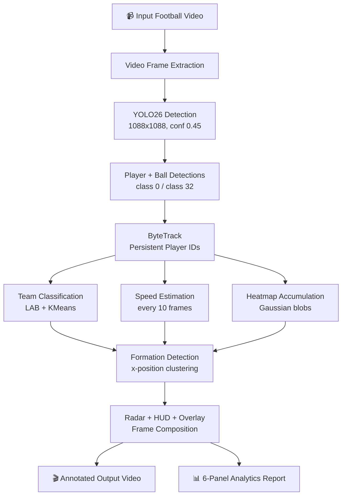
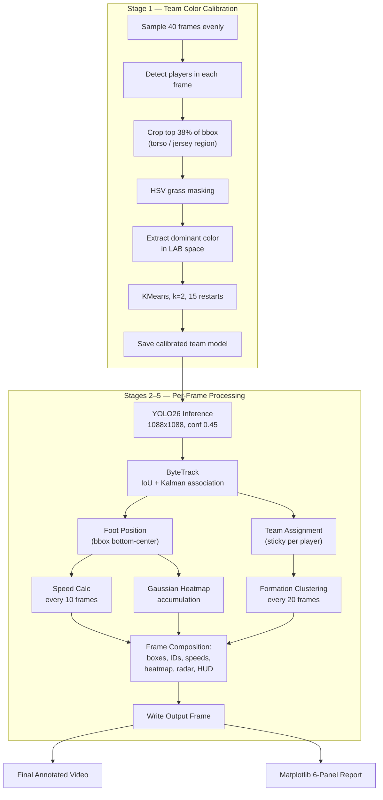
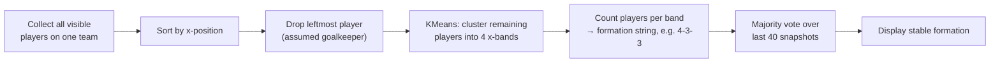

<div align="center">

# ⚽ Football Tactical Analyzer

### Real-Time Football Computer Vision & Tactical Analytics

**Player Tracking · Heatmaps · Speed Estimation · Formation Detection — powered by YOLO26**

[](https://www.python.org/)
[](https://docs.ultralytics.com)
[](https://docs.opencv.org)
[](https://scikit-learn.org)
[](https://numpy.org)
[](https://matplotlib.org)
[](https://colab.research.google.com)

</div>

---

## 📌 Overview

**Football Tactical Analyzer** turns a raw broadcast football clip into a fully annotated tactical breakdown — without any custom model training. Built on top of **YOLO26**'s pretrained COCO weights, it detects players and the ball, tracks them consistently across frames with **ByteTrack**, and layers on a full analytics pipeline: automatic team classification, positional heatmaps, per-player speed estimation, live formation detection, and a bird's-eye radar view.

The entire system runs inside **Google Colab** on a free T4 GPU — no proprietary tooling, no labeled dataset, no local installation.

The project is built around three tactical questions, answered automatically from a standard video clip:

> 🟠 **Where** do teams spend their time on the pitch?
> ⚡ **How fast** are individual players moving?
> 🧩 **What formation** is each team playing?

---

## ✨ Why This Project?

Professional clubs like Manchester City and Barcelona run dedicated data science teams on top of expensive, proprietary tracking rigs. This project demonstrates that a surprisingly capable analysis pipeline — territorial heatmaps, speed profiling, and formation inference — can be assembled entirely from **open-source components and a pretrained detector**, with zero custom training required to get started.

---

## 🚀 Key Features

| Feature | What It Does |
|---|---|
| 🎯 **Real-Time Player Detection** | YOLO26 detects every person (class `0`) in each frame at `1088×1088` resolution with a `0.45` confidence threshold. |
| ⚽ **Ball Detection** | The same YOLO26 pass detects the ball (COCO class `32`) during open-play sequences. |
| 🔗 **Multi-Object Player Tracking** | ByteTrack assigns a persistent numeric ID to every player, resolving identity across occlusion and fast motion using IoU matching and Kalman-predicted positions. |
| 🎨 **Automatic Team Classification** | Jersey torso crops are compared in **LAB color space** (with grass filtered out via HSV masking) and clustered with **KMeans (2 clusters)** — no manual labeling needed. |
| 🌡️ **Team-Separated Heatmaps** | Gaussian accumulation at each player's foot position builds a persistent occupancy map per team, rendered in distinct colormaps. |
| 🏃 **Player Speed Estimation** | Converts pixel displacement (sampled every 10 frames) into km/h using known pitch geometry, with artifact filtering and rolling averaging. |
| 🧩 **Formation Detection** | Geometric x-position clustering infers each team's shape (e.g., `4-3-3`) with majority voting for stability. |
| 🗺️ **Tactical Radar / Bird's-Eye View** | A miniature 190×120 pixel overhead pitch shows real-time team shape and spacing. |
| 🎬 **Annotated Match Video** | All overlays — boxes, IDs, speeds, heatmaps, radar, HUD — are composited directly onto the output video. |
| 📊 **6-Panel Analytics Report** | A single Matplotlib figure summarizing heatmaps, speed distribution, top speeds, and formation timeline. |

---

## 🎥 Demo

> Add your annotated output video / GIF here — e.g. embed `assets/demo.gif` once generated by the pipeline.

Suggested asset paths for this repository:

```
assets/demo.gif
assets/heatmap.png
assets/radar.png
assets/analytics-report.png
```

Ideally, screenshots/GIFs should showcase:
- A frame with player boxes, tracking IDs, and live speed labels
- The team-separated heatmap overlay on the pitch
- The bird's-eye radar panel in the corner of the frame
- The full 6-panel analytics report PNG

---

## 🏗️ System Architecture



---

## 🔬 End-to-End Pipeline

The system runs in five sequential stages, plus an upfront calibration phase.



---

## ⚙️ How Each Component Works

### 1. Team Color Calibration

Before the main loop runs, the system samples **40 frames** evenly across the video. For every detected player, it crops the **top 38%** of the bounding box — isolating the torso/jersey region — and extracts the dominant color in **LAB color space**, chosen because it handles varying lighting conditions far better than HSV or RGB. Grass pixels are filtered out first using an **HSV-based mask** so the green pitch doesn't skew the jersey color signal. All collected colors are then clustered into **2 groups with KMeans (15 restarts)**, producing a calibrated team-classification model used for the rest of the clip.

### 2. Detection and Tracking

Each frame is passed to **YOLO26** at **1088×1088** resolution with a **0.45 confidence threshold**, detecting persons (class `0`) and the ball (class `32`). Person detections are handed to **ByteTrack**, which solves the data-association problem frame-to-frame using a combination of IoU matching and Kalman-predicted positions. This is what allows the same player to keep the same numeric ID through occlusion and fast movement — rather than "tracking players," ByteTrack maintains **persistent identities across frames**, which is what lets downstream speed and positional analytics operate on a continuous per-player history instead of disconnected detections.

### 3. Per-Player Analysis

Three analyses run in parallel for every tracked player:

- **Team Assignment** — jersey color is extracted and classified against the pre-calibrated KMeans model. Once assigned, the team ID is **sticky**: a player is never reassigned mid-clip.
- **Speed Estimation** — see the dedicated section below.
- **Heatmap Accumulation** — see the dedicated section below.

### 4. Formation Detection

See the dedicated section below.

### 5. Frame Composition and Output

Heatmaps are normalized, colormapped (`AUTUMN` for Team A, `WINTER` for Team B), and blended onto the frame only where signal exceeds a threshold of **8** — keeping the pitch visually clean where no player has been present. The radar map, formation panel, speed labels, and HUD bar are composited on top, and the final frame is written to the output video.

---

## 🌡️ Heatmap Generation

Each frame, the **foot position** (bottom-center of each player's bounding box) is recorded. A **Gaussian blob with an 18-pixel radius** is added to a persistent 2D accumulation array at that position. Over hundreds of frames, zones with frequent player presence build up substantially higher values than sparsely visited areas.

The accumulation array is normalized to **0–255** and passed through OpenCV colormap functions:

- **Team A** → `COLORMAP_AUTUMN` (black → orange → yellow → white)
- **Team B** → `COLORMAP_WINTER` (blue → cyan gradient)

Pixels with a normalized value **below 8 are masked out entirely**, so unoccupied areas of the pitch stay visually clean instead of being darkened. In zones where both teams were present, a **50/50 blend** of both colormaps is applied to visually flag contested areas.

> **Tactically, this can reveal:** territorial occupation patterns, pressing zones near the opponent's half, and defensive concentration near a team's own box. These are visual, frame-accumulated indicators — **not** professional-grade positional tracking data.

---

## 🏃 Speed Estimation

Speed is estimated from pixel displacement between two recorded foot positions, converted to real-world distance using assumed pitch geometry:

```
Speed (km/h) = (pixel_displacement × meters_per_pixel) / (elapsed_frames / FPS) × 3.6

meters_per_pixel = 105.0 / frame_width
```

**Why not every frame?** YOLO bounding boxes exhibit roughly **1–3 pixels of detection jitter** even for a completely stationary player. At 25 FPS, that jitter alone translates into ~5 km/h of *phantom* speed if measured frame-to-frame. Instead, displacement is measured **every 10 frames** (`SPEED_COMPUTE_EVERY`) — long enough that jitter averages out to near zero for stationary players while real movement is still captured accurately.

- Readings above **35 km/h** are discarded as tracking artifacts.
- The displayed value is a **rolling average of the last 6 valid readings**, smoothing display without hiding genuine sprint speed.

> ⚠️ **This is a geometric estimate, not ground truth.** It relies on pixel displacement and an assumed pitch length — it is **not** GPS tracking, optical-flow-based motion estimation, or a calibrated homography measurement.

---

## 🧩 Formation Detection

Formation detection is a **geometric heuristic**, run every 20 frames:



- A minimum of **8 visible players** is required before a formation is computed — below that, the system displays `?` rather than guessing.
- Results are **majority-voted over the last 40 snapshots** (~10–15 seconds of video) to suppress momentary positional noise.

> This approach assumes a wide-angle camera where the goalkeeper is reliably the leftmost detected player. It is a heuristic approximation of team shape, not a verified tactical classification.

---

## 🗺️ Radar Map

A **190 × 120 pixel** miniature pitch is rendered in the bottom-right corner of every frame, showing:

- Pitch boundary
- Halfway line
- Center circle
- Every detected player as a filled dot at their scaled screen position — **orange for Team A, blue for Team B**

This gives an at-a-glance read on team shape and spacing that's easier to parse at speed than the full broadcast frame.

---

## 📊 Analytics Report

After the main loop completes, a single **6-panel Matplotlib figure** is generated and saved as a PNG:

| Panel | Content |
|---|---|
| **1 — Team A Heatmap** | Normalized accumulation array rendered with the `autumn` colormap. |
| **2 — Team B Heatmap** | Normalized accumulation array rendered with the `winter` colormap. |
| **3 — Combined Heatmap** | RGB composite — Team A in the red channel, Team B in the blue channel. |
| **4 — Speed Distribution** | Histogram of all speed readings across both teams. |
| **5 — Top Speeds per Player** | Horizontal bar chart of each tracked player's maximum recorded speed. |
| **6 — Formation Timeline** | Scatter plot of each team's detected formation over the duration of the clip. |

---

## 🧰 Technology Stack

| Technology | Role in the Project |
|---|---|
| **YOLO26 (Ultralytics)** | Core object detector — identifies players and the ball using pretrained COCO weights, no custom training. |
| **ByteTrack (Supervision)** | Multi-object tracker — assigns and maintains a consistent ID per player across frames. |
| **Supervision** | Detection-format and tracking utility library wrapping ByteTrack. |
| **KMeans (scikit-learn)** | Unsupervised clustering — used for team-color calibration *and* formation x-band clustering. |
| **LAB Color Space (OpenCV)** | Perceptually uniform color space for comparing jersey colors under varying lighting. |
| **HSV Masking (OpenCV)** | Filters out green grass pixels before jersey-color extraction. |
| **Kalman Filter (filterpy)** | Smooths bounding-box position jitter for cleaner visual rendering — **not** used in the speed calculation. |
| **Gaussian Accumulation (NumPy)** | Builds heatmaps by adding a smooth blob at each player's foot position every frame. |
| **Matplotlib** | Generates the 6-panel analytics report. |
| **Google Colab** | Cloud GPU execution environment (free T4 tier). |

---

## 🎛️ Configuration Parameters

| Parameter | Default | Explanation |
|---|---|---|
| `CONF_THRESHOLD` | `0.45` | Minimum YOLO26 detection confidence. Lower detects more players but increases false positives. |
| `IMG_SIZE` | `1088` | Inference resolution (must be a multiple of 32). Higher = better accuracy, slower processing. |
| `HEATMAP_ALPHA` | `0.50` | Blending strength of the heatmap overlay onto the video. `0` = invisible, `1` = fully opaque. |
| `BLOB_RADIUS` | `18` | Gaussian blob radius (pixels) added per player position sample. |
| `SPEED_COMPUTE_EVERY` | `10` | Frames between speed recalculations. Higher = more stable but slower to react. |
| `MAX_SPEED_KMH` | `35.0` | Hard cap on speed readings; values above this are treated as tracking artifacts. |
| `MIN_PLAYERS_FORMATION` | `8` | Minimum visible players required before a formation is computed. |
| `FIELD_LENGTH_M` | `105.0` | Assumed pitch length in meters, used for pixel-to-meter speed conversion. |

---

## 🧠 Model

- **Default model:** `YOLO26n` (nano) — chosen for compatibility with Google Colab's free-tier GPU.
- **Upgrade path:** `YOLO26s` (small) can be selected for improved detection accuracy on larger GPU instances by changing a single config variable.
- **Weights:** Pretrained **COCO** weights, downloaded automatically via Ultralytics on first run.
- **No custom training** is currently required or used.

---

## 🛠️ Setup / Running

This project is designed to run inside **Google Colab**, with dependencies installed at runtime — there is currently no packaged CLI or standalone application.

**Documented runtime dependencies:**

```
ultralytics
supervision
opencv-python-headless
scikit-learn
filterpy
numpy
matplotlib
```

**Suggested workflow:**

1. Open the notebook in Google Colab.
2. Run the setup cell to install dependencies (`ultralytics`, `supervision`, `opencv-python-headless`, `scikit-learn`, `filterpy`, `numpy`, `matplotlib`).
3. Upload or provide the football video clip to be analyzed.
4. Run the team-color calibration stage (samples 40 frames, fits the KMeans model).
5. Run the main processing pipeline (detection → tracking → analysis → composition).
6. Retrieve the generated annotated output video and the 6-panel analytics report PNG.

> 💡 For meaningfully faster processing, switch the Colab runtime to a T4 GPU (`Runtime → Change runtime type`).

---

## 📈 Results

Tested on **broadcast UEFA Champions League match clips at 1080p resolution**. These are observed outcomes from testing, not formal benchmark scores — no accuracy, precision, recall, mAP, or FPS figures are claimed.

**Detection Performance**
- Player detection: consistently detected **15–20 players per frame** on wide-angle broadcast footage.
- Ball detection: successful during open-play sequences; missed during blocked views or very fast motion.
- Team separation: correctly separated teams across all tested clips with visually distinct jersey colors.

**Heatmap Quality**
- Meaningful accumulation after roughly **200 frames (~8 seconds at 25 FPS)**.
- After **500+ frames**, heatmaps clearly showed territorial patterns — e.g. a pressing team's hotspots near the opponent's half, and a defending team concentrated near their own box.

**Speed Accuracy**

| Player State | Observed Speed |
|---|---|
| Stationary | 0.0 – 1.5 km/h |
| Walking | 4 – 7 km/h |
| Sprinting | 18 – 30 km/h |

Stationary readings near zero confirm the 10-frame computation window is effectively suppressing detection jitter, and sprint readings fall within a realistic range for football players (elite sprints reach 32–35 km/h).

---

## ⚠️ Limitations

> Honest, transparent assessment — not every failure mode has a workaround yet.

1. **Formation detection is heuristic, not ground truth.** It works best on wide-angle footage where all 11 players are visible.
2. **Close-up camera angles break the formation assumption** — not enough players are visible to cluster reliably.
3. **Speed estimation assumes the full pitch width is visible in frame.** Zoomed-in shots inflate readings because the meters-per-pixel ratio is miscalculated.
4. **Team color separation can fail** when both teams wear similar (e.g. both dark) kits.
5. **Poor lighting conditions** reduce team-classification reliability even with LAB-space comparison.
6. **YOLO26's pretrained `person` class detects everyone** — referees, coaches, and ball boys are picked up alongside players. Field-position post-filtering is not currently implemented.
7. **No temporal memory across occlusion exits.** If a player leaves the frame and re-enters, ByteTrack may assign a **new ID**, resetting that player's speed history and team assignment.

---

## 🗺️ Future Roadmap

- [ ] **Fine-tune YOLO26 on a football-specific dataset** to better distinguish referees/coaches from players.
- [ ] **Ball-player proximity analysis** to estimate possession.
- [ ] **Homography transformation** to map all player positions onto a canonical top-down pitch view, independent of camera angle.

---

## 📁 Repository Contents

This repository currently consists of a **single self-contained Jupyter notebook** — calibration, detection, tracking, speed estimation, heatmap accumulation, formation detection, frame composition, and analytics-report generation all run end-to-end inside one `.ipynb` file, designed to be opened and run directly in Google Colab.

```
football-tactical-analyzer/
└── football_analyzer.ipynb   # Full pipeline: calibration → detection → tracking → analytics
```

---

## 🔖 Repository Topics

`football` `football-analytics` `sports-analytics` `computer-vision` `object-detection` `yolo` `yolo26` `bytetrack` `player-tracking` `sports-ai` `machine-learning` `deep-learning` `opencv` `python` `heatmap` `formation-detection` `speed-estimation` `tactical-analysis`

**Suggested one-line repository description:**

> Automated football tactical analysis from broadcast video using YOLO26 + ByteTrack — player tracking, team heatmaps, speed estimation, and formation detection, no custom training required.

<div align="center">

---

⚽ Built with YOLO26, ByteTrack, and a lot of KMeans clustering.

</div>

---

